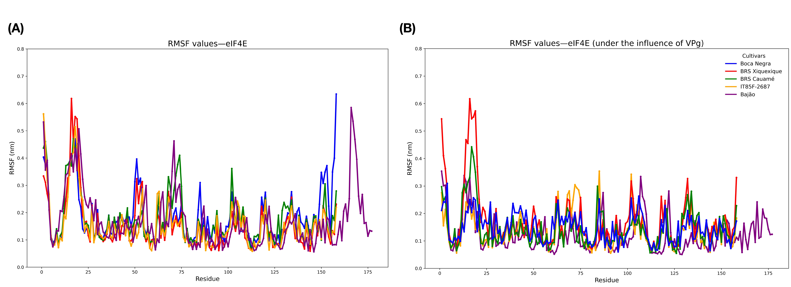
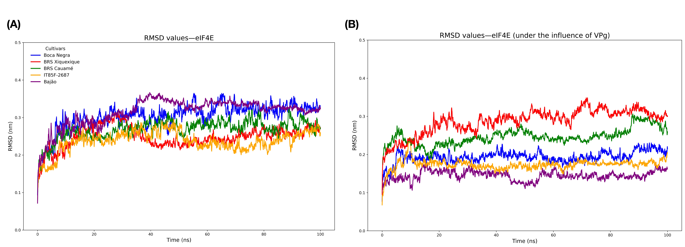
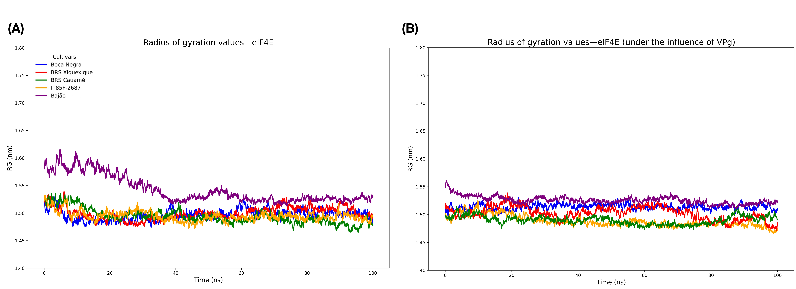
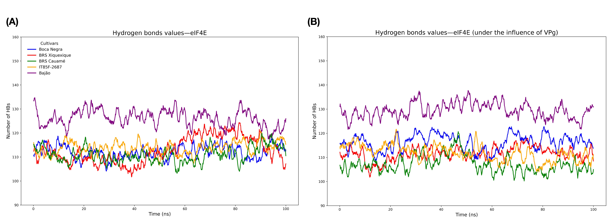

# Simulação de Dinâmica Molecular da Lisozima com GROMACS

Este repositório contém um tutorial completo e detalhado para a simulação de dinâmica molecular (MD) da lisozima em solução aquosa utilizando o GROMACS. A dinâmica molecular é uma técnica computacional indispensável para investigar a estrutura, a dinâmica e a energética de biomoléculas em resolução atômica. Este material abrange desde a preparação inicial do sistema até a simulação produtiva, com explicações e códigos detalhados para cada etapa.

---

Deixo um artigo de revisão sobre tutoriais de simulações em Dinâmica Molecular, como material de apoio.

```
Lemkul, J. A. Introductory Tutorials for Simulating Protein Dynamics with GROMACS. J. Phys. Chem. B 2024, 128 (39), 9418-9435. DOI: 10.1021/acs.jpcb.4c04901
```
Disponível para leitura em [PDF](https://pubs.acs.org/doi/pdf/10.1021/acs.jpcb.4c04901).

---

## Índice

- [Simulação de Dinâmica Molecular da Lisozima com GROMACS](#simulação-de-dinâmica-molecular-da-lisozima-com-gromacs)
  - [Índice](#índice)
  - [Introdução](#introdução)
  - [Requisitos](#requisitos)
  - [Campos de Força (Force Fields)](#campos-de-força-force-fields)
  - [Tipos de Arquivos GROMACS](#tipos-de-arquivos-gromacs)
  - [Fluxo de Trabalho](#fluxo-de-trabalho)
  - [Detalhamento das Etapas](#detalhamento-das-etapas)
    - [1. Preparação da Topologia da Proteína](#1-preparação-da-topologia-da-proteína)
    - [2. Definição da Caixa e Solvatação](#2-definição-da-caixa-e-solvatação)
    - [3. Adição de Íons](#3-adição-de-íons)
    - [4. Minimização de Energia](#4-minimização-de-energia)
    - [5. Equilibração NVT (Temperatura Constante)](#5-equilibração-nvt-temperatura-constante)
    - [6. Equilibração NPT (Pressão Constante)](#6-equilibração-npt-pressão-constante)
    - [7. Simulação Produtiva (MD)](#7-simulação-produtiva-md)
    - [8. Pós-processamento e Análise de Resultados](#8-pós-processamento-e-análise-de-resultados)
      - [8.1 Cálculo do RMSF (Root-Mean-Square Fluctuation)](#81-cálculo-do-rmsf-root-mean-square-fluctuation)
      - [8.2 Cálculo do RMSD (Root-Mean-Square Deviation)](#82-cálculo-do-rmsd-root-mean-square-deviation)
      - [8.3 Cálculo do Raio de Giração (Radius of Gyration)](#83-cálculo-do-raio-de-giração-radius-of-gyration)
      - [8.4 Cálculo do Número de Ligações de Hidrogênio](#84-cálculo-do-número-de-ligações-de-hidrogênio)
      - [8.5 Interpretação dos Resultados](#85-interpretação-dos-resultados)
  - [Como Executar o Tutorial](#como-executar-o-tutorial)
  - [Possíveis Erros e Soluções](#possíveis-erros-e-soluções)
  - [Referências](#referências)
  - [Licença](#licença)

---

## Introdução

A dinâmica molecular permite estudar sistemas biomoleculares com uma resolução espacial e temporal que excede a maioria dos métodos experimentais. A lisozima é um sistema modelo clássico para esses estudos devido à sua estabilidade e estrutura bem caracterizada. Este tutorial guia o usuário através de um fluxo de trabalho fundamental para simular a lisozima em água, estabelecendo uma base sólida para projetos de simulação mais complexos.

---

## Requisitos

Antes de iniciar, certifique-se de ter os seguintes softwares instalados:

- **GROMACS** (versão recomendada: 2022 ou superior)
- **Python** (para scripts de análise e automação)
- **Visualizador Molecular:** `VMD` ou `PyMOL` para inspeção de trajetórias.
- **Arquivo PDB:** Estrutura da lisozima (ex: `1AKI.pdb` do Protein Data Bank).

Instale o GROMACS com:
```bash
sudo apt install gromacs
```
Ou, preferencialmente, via Conda para um melhor gerenciamento de ambientes:
```bash
conda install -c bioconda gromacs
```

---

## Campos de Força (Force Fields)

A precisão de uma simulação de MD depende fundamentalmente da qualidade do campo de força (force field) utilizado. Um campo de força é um conjunto de equações e parâmetros associados que descrevem a energia de uma dada configuração de átomos, aplicando os princípios da mecânica newtoniana para prever a evolução do sistema ao longo do tempo.

Existem muitos campos de força disponíveis, como **CHARMM**, **AMBER**, **GROMOS** e **OPLS**. Cada um possui parametrizações e pressupostos específicos. É crucial que as configurações da simulação (especificadas no arquivo `.mdp`) sejam consistentes com o campo de força escolhido. Isso inclui:

- **Modelo de Água:** Cada campo de força é calibrado com um modelo de água específico. Por exemplo, o campo de força CHARMM36 utiliza uma versão modificada do TIP3P. Usar o modelo de água incorreto pode levar a resultados imprecisos.
- **Parâmetros de Interação:** As configurações para o tratamento de interações não-ligadas (eletrostática e van der Waals), como os raios de corte (`cutoff`), devem ser consideradas como parte integrante do campo de força e não devem ser alteradas sem uma justificativa robusta.

Ao usar o `gmx pdb2gmx`, você selecionará um dos campos de força disponíveis para o GROMACS, e todas as etapas subsequentes devem respeitar as convenções desse campo de força.

---

## Tipos de Arquivos GROMACS

O GROMACS utiliza uma variedade de tipos de arquivos com extensões específicas. Abaixo estão os mais comuns encontrados neste tutorial:

- **`.gro`:** um arquivo de coordenadas de formato fixo com coordenadas dadas em unidades de nm.
- **`.pdb`:** um arquivo de coordenadas de formato fixo usado pelo Protein Databank com coordenadas em unidades de Å.
- **`.top`:** uma topologia do sistema, definindo o conteúdo completo de um sistema.
- **`.itp`:** uma topologia "incluída", definindo um tipo de molécula específico, parâmetros auxiliares ou outras diretivas topológicas.
- **`.mdp`:** arquivo de "parâmetros de dinâmica molecular" que especifica todas as configurações relevantes para realizar um cálculo ou simulação.
- **`.tpr`:** um arquivo de entrada de execução binário que combina coordenadas, topologia, todos os parâmetros do campo de força associados e todas as configurações de entrada definidas no arquivo .mdp.
- **`.edr`:** um arquivo binário contendo dados de energia do cálculo ou simulação.
- **`.xtc`:** um arquivo de trajetória binário em formato compactado contendo informações de tempo, vetor da caixa e coordenadas.
- **`.trr`:** um arquivo de trajetória de alta precisão contendo informações de tempo, vetor da caixa, coordenadas, velocidade e força.

---

## Fluxo de Trabalho

1.  **Preparação da Topologia:** Gerar uma topologia compatível com o campo de força a partir da estrutura PDB.
2.  **Definição da Caixa e Solvatação:** Criar uma caixa de simulação periódica e preenchê-la com moléculas de solvente (água).
3.  **Adição de Íons:** Adicionar íons para neutralizar a carga líquida do sistema e atingir uma concentração iônica desejada.
4.  **Minimização de Energia:** Remover contatos estéricos desfavoráveis e relaxar a geometria do sistema.
5.  **Equilibração NVT:** Estabilizar a temperatura do sistema, mantendo volume e número de partículas constantes.
6.  **Equilibração NPT:** Estabilizar a pressão e a densidade do sistema, mantendo temperatura e número de partículas constantes.
7.  **Simulação Produtiva:** Executar a simulação para coletar os dados, sem o uso de restrições.
8.  **Pós-processamento e Análise:** Extrair e analisar as propriedades estruturais e dinâmicas da proteína.

---

## Detalhamento das Etapas

### 1. Preparação da Topologia da Proteína

O primeiro passo é usar `gmx pdb2gmx` para ler o arquivo PDB (aqui chamado `model.pdb`), gerar uma topologia (`topol.top`) e um arquivo de coordenadas (`.gro`) compatível com o GROMACS.

```bash
# O GROMACS solicitará que você selecione um campo de força e um modelo de água da lista.
gmx pdb2gmx -f model.pdb -o model_processed.gro -water spce -ignh
```
- **Seleção Interativa:**
  1.  Escolha um campo de força da lista (ex: `CHARMM36-jul2022`).
  2.  Escolha o modelo de água correspondente (ex: `TIP3P`).

### 2. Definição da Caixa e Solvatação

Definimos uma caixa de simulação periódica e a preenchemos com moléculas de água.

```bash
# Define uma caixa cúbica a 1.0 nm da superfície da proteína.
gmx editconf -f model_processed.gro -o model_newbox.gro -c -d 1.0 -bt cubic
```

```bash
# Preenche a caixa com moléculas de água.
gmx solvate -cp model_newbox.gro -cs spc216.gro -o model_solv.gro -p topol.top
```

### 3. Adição de Íons

Neutralizamos a carga do sistema e adicionamos íons para simular uma concentração fisiológica.

```bash
# Prepara o sistema para a adição de íons.
gmx grompp -f ions.mdp -c model_solv.gro -p topol.top -o ions.tpr -maxwarn 5
```bash
# Adiciona íons Na+ e Cl- a uma concentração de 0.15 M e neutraliza a carga do sistema.
gmx genion -s ions.tpr -o model_solv_ions.gro -p topol.top -neutral -conc 0.15 -pname NA -nname CL
```
- **Seleção Interativa:** Quando solicitado, selecione o grupo de solvente a ser substituído pelos íons (geralmente `13 SOL`).

### 4. Minimização de Energia

Remove clivagens estéricas e relaxa a geometria do sistema.

```bash
# Prepara o sistema para a minimização.
gmx grompp -f minim.mdp -c model_solv_ions.gro -p topol.top -o em.tpr -maxwarn 5

# Executa a minimização de energia.
gmx mdrun -v -deffnm em -s em.tpr
```

### 5. Equilibração NVT (Temperatura Constante)

Estabiliza a temperatura do sistema com restrições de posição na proteína.

```bash
# Prepara o sistema para o equilíbrio NVT.
gmx grompp -f nvt.mdp -c em.gro -p topol.top -o nvt.tpr -r em.gro -maxwarn 5

# Executa o equilíbrio NVT.
gmx mdrun -deffnm nvt -v -s nvt.tpr
```

### 6. Equilibração NPT (Pressão Constante)

Estabiliza a pressão e a densidade do sistema, mantendo as restrições.

```bash
# Prepara o sistema para o equilíbrio NPT.
gmx grompp -f npt.mdp -c nvt.gro -t nvt.cpt -p topol.top -o npt.tpr -r em.gro -maxwarn 5

# Executa o equilíbrio NPT.
gmx mdrun -deffnm npt -v -s npt.tpr
```

### 7. Simulação Produtiva (MD)

Executa a simulação principal sem restrições para coletar dados.

```bash
# Prepara o sistema para a simulação de produção.
gmx grompp -f md.mdp -c npt.gro -t npt.cpt -p topol.top -o md_0_1.tpr -maxwarn 5

# Executa a simulação produtiva.
gmx mdrun -deffnm md_0_1 -v
```

### 8. Pós-processamento e Análise de Resultados

> **Nota sobre os Exemplos de Imagens:** As imagens utilizadas como exemplos nesta seção foram retiradas do artigo: Andrade, F.A.d.; Luna-Aragão, M.A.d.; Ferreira, J.D.C.; Souza, F.F.; Rocha Oliveira, A.C.d.; Costa, A.F.d.; Aragão, F.J.L.; Santos-Silva, C.A.d.; Benko-Iseppon, A.M.; Pandolfi, V. *Deciphering Cowpea Resistance to Potyvirus: Assessment of eIF4E Gene Mutations and Their Impact on the eIF4E-VPg Protein Interaction*. Viruses **2025**, *17*, 1050. https://doi.org/10.3390/v17081050. 

> Este trabalho utilizou técnicas de genômica, modelagem e dinâmica molecular, docking e análises avançadas de interações moleculares, sendo um excelente exemplo de aplicações das metodologias abordadas nesta aula. O artigo pode ser acessado em: https://www.mdpi.com/1999-4915/17/8/1050

Analisa a trajetória gerada (`md_0_1.xtc`).

#### 8.1 Cálculo do RMSF (Root-Mean-Square Fluctuation)

```bash
# O GROMACS solicitará a seleção do grupo para o cálculo.
gmx rmsf -s md_0_1.tpr -f md_0_1.xtc -o rmsf.xvg -res
```
- **Seleção Interativa:** Escolha `3 C-alpha`.

**Exemplo de gráfico RMSF:**



*O gráfico mostra a flexibilidade de cada resíduo. Resíduos com picos indicam alta flexibilidade (>0.25 nm), típicos de loops e regiões móveis.*

#### 8.2 Cálculo do RMSD (Root-Mean-Square Deviation)

```bash
# O GROMACS solicitará a seleção do grupo para o ajuste e para o cálculo.
gmx rms -s md_0_1.tpr -f md_0_1.xtc -o rmsd.xvg -tu ns
```

- **Seleção Interativa:** Escolha `4 Backbone` para o ajuste e `4 Backbone` novamente para o cálculo.

**Exemplo de gráfico RMSD:**



*O gráfico mostra o desvio da estrutura ao longo do tempo. Um plateau estável indica a convergência da simulação.*

#### 8.3 Cálculo do Raio de Giração (Radius of Gyration)

```bash
# O GROMACS solicitará a seleção do grupo para o cálculo.
gmx gyrate -s md_0_1.tpr -f md_0_1.xtc -o giracao.xvg
```

- **Seleção Interativa:** Escolha `1 Protein`.

**Exemplo de gráfico do Raio de Giração:**



*O gráfico mostra a compactação da proteína ao longo do tempo.*

#### 8.4 Cálculo do Número de Ligações de Hidrogênio

```bash
# O GROMACS solicitará a seleção de dois grupos para o cálculo.
gmx hbond -s md_0_1.tpr -f md_0_1.xtc -num hbond_intra.xvg
```

- **Seleção Interativa:** Escolha `1 Protein` para o primeiro grupo e `1 Protein` novamente para o segundo.

**Exemplo de gráfico de Ligações de Hidrogênio:**



*O gráfico mostra o número de ligações de hidrogênio intramoleculares ao longo do tempo. Flutuações são normais e indicam a dinâmica natural da proteína.*

#### 8.5 Interpretação dos Resultados

**RMSD (Root-Mean-Square Deviation):**

- Valores típicos para proteínas estáveis: 0.1-0.3 nm
- Tendência crescente indica possível desnaturação
- Plateau indica estabilização da estrutura

**RMSF (Root-Mean-Square Fluctuation):**

- Loops e terminais: alta flexibilidade (>0.3 nm)
- Folhas-β e α-hélices: baixa flexibilidade (<0.2 nm)
- Picos indicam regiões móveis importantes

**Raio de Giração:**

- Proteína compacta: ~1.4-1.6 nm para lisozima
- Variações pequenas (<5%) indicam estabilidade
- Aumentos significativos sugerem desdobramento

**Ligações de Hidrogênio:**

- Lisozima: ~100-130 ligações H intramoleculares
- Flutuações normais: ±10-15 ligações
- Perdas significativas indicam instabilidade estrutural

---

## Como Executar o Tutorial

1.  **Clone o repositório:**
    ```bash
    git clone [https://github.com/madsondeluna/aula_dinamica_molecular.git](https://github.com/madsondeluna/aula_dinamica_molecular.git)
    ```
2.  **Acesse o diretório:**
    ```bash
    cd aula_dinamica_molecular
    ```
3.  **Execute os comandos** na sequência apresentada na seção [Detalhamento das Etapas](#detalhamento-das-etapas).

---

## Possíveis Erros e Soluções

1.  **Erro `Fatal error: number of coordinates in coordinate file does not match topology`**
    -   **Causa**: O arquivo de coordenadas (`.gro`) e o de topologia (`.top`) estão dessincronizados. Isso geralmente acontece se um passo que adiciona/remove moléculas (como `gmx solvate` ou `gmx genion`) foi executado sem a flag `-p topol.top`.
    -   **Solução**: Refaça o passo problemático garantindo que a flag `-p` seja usada para atualizar a topologia.

2.  **Mensagem `Water molecule cannot be settled` ou instabilidade na simulação (LINCS warnings)**
    -   **Causa**: Uma geometria inicial muito ruim ou um passo de tempo (`dt`) muito grande no arquivo `.mdp`.
    -   **Solução**: Certifique-se de que a minimização de energia foi bem-sucedida. Se o erro persistir, reduza o `dt` no seu arquivo `.mdp` (ex: de 0.002 para 0.001).

3.  **Erro de `pdb2gmx` sobre nomes de átomos ou resíduos não reconhecidos**
    -   **Causa**: O arquivo PDB contém nomes de átomos ou resíduos não padrão.
    -   **Solução**: Use a flag `-ignh` para que o GROMACS reconstrua todos os hidrogênios. Se o erro for com átomos pesados, pode ser necessário editar o arquivo PDB manualmente.

4.  **Visualização "quebrada" da molécula no VMD/PyMOL**
    -   **Causa**: Artefato das condições de contorno periódicas.
    -   **Solução**: Use `gmx trjconv` para processar a trajetória antes de visualizar:
        ```bash
        gmx trjconv -s md_0_1.tpr -f md_0_1.xtc -o md_whole.xtc -pbc whole
        gmx trjconv -s md_0_1.tpr -f md_whole.xtc -o md_final.xtc -pbc nojump -center
        ```
    - **Seleção Interativa:** Para ambos os comandos, selecione `1 Protein` para centrar e `0 System` para a saída.

---

## Referências

- Lemkul, J. A. *J. Phys. Chem. B* **2024**, *128*, 9418-9435.
- [GROMACS Manual](http://www.gromacs.org/Documentation)
- [MD Tutorials – Lysozyme in Water](https://www.mdtutorials.com/gmx/lysozyme/)

---

## Licença

Este projeto está licenciado sob a [MIT License](LICENSE).
